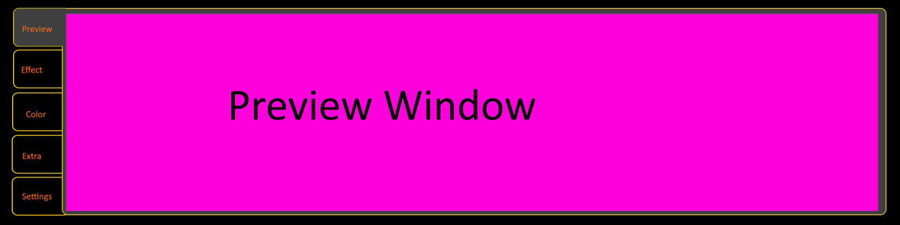

# Pi Launchpad Controller

The Pi Launchpad Controller is a fullscreen touchscreen controller for a Raspberry Pi 3 with a `1920x480` Waveshare display. It is intended to replace one or more hardware MIDI control surfaces with a kiosk-style UI that starts automatically on boot and communicates with the existing lightcontrol stack over the repo's network MIDI protocol.

The current mock layout is shown here:

## Goal

Build one Raspberry Pi application that combines:

- an Art-Net preview panel
- touch-driven virtual controller panels
- persistent settings
- boot-time autostart without a desktop environment

The important compatibility requirement is that the software must speak the same UDP MIDI protocol already used by [../NetworkMidi/README.md](../NetworkMidi/README.md) so that existing show code can use it without large changes.

## Existing Repo Integration Points

The implementation should reuse the conventions that already exist in this repository.

### Network MIDI protocol

- Transport: UDP
- Short MIDI messages: raw 3-byte MIDI payloads
- SysEx: one full datagram per message
- Heartbeat: JSON UDP packet as documented in [../NetworkMidi/README.md](../NetworkMidi/README.md)

### Current port conventions in the show software

Based on [../../nachtgestalter3000_MK2.py](../../nachtgestalter3000_MK2.py):

- `21928`: APC20
- `21930`: Launchpad MK2
- `21931`: Launch Control
- `22990`: heartbeat listener

### Existing controller definitions

- Launch Control mapping: [../../controllers/descriptions/launchcontrol.py](../../controllers/descriptions/launchcontrol.py)
- Launchpad MK2 mapping: [../../controllers/descriptions/launchpad.py](../../controllers/descriptions/launchpad.py)
- Existing Pi Art-Net preview: [../PiDisplay/README.md](../PiDisplay/README.md)

### Current deployment assumptions

- Raspberry Pi 3
- Waveshare `8.8"` DSI capacitive touchscreen
- Landscape bar layout (`1920x480`)
- No desktop session; start from `systemd`

## Functional Scope

The UI should stay modular. Every tab should be implemented as a standalone module with a small contract:

- render itself into the main app surface
- receive touch events
- send and receive network MIDI events if needed
- expose settings/state needed for persistence

The current scope is five tabs.

### 1. Preview tab

Purpose:

- show the Art-Net preview on the left/top tab entry by default
- reuse the existing Pi display behavior as far as practical

Requirements:

- configurable Art-Net bind address / interface
- configurable matrix size (`cols`, `rows`)
- configurable rotate / stretch behavior
- visible "no signal" state when Art-Net is missing
- lightweight overlay for fps / packet status

Notes:

- The existing preview code in `tools/PiDisplay` is a standalone fullscreen SDL app. For this project it must either be embedded, ported, or reimplemented as a panel renderer inside the new app.

### 2. Effect tab

Purpose:

- emulate one virtual `Launch Control` surface used by the show code

Compatibility target:

- same logical layout as [../../controllers/descriptions/launchcontrol.py](../../controllers/descriptions/launchcontrol.py)
- same init SysEx behavior as the current Launch Control bridge
- same feedback behavior for buttons and current values where applicable

Expected controls:

- `2 x 8` knobs
- `8` track buttons
- arrow buttons

Default transport target:

- UDP port `21931`
- explicit heartbeat name, ideally configurable

### 3. Color tab

Purpose:

- provide a fast touch UI for primary and secondary synth color selection

Minimum controls:

- primary color picker
- secondary color picker
- optional brightness / saturation helper
- optional preset swatches for fast recall

Important note:

- This tab requires a new network MIDI contract. That contract does not exist yet in the repo and must be specified before implementation starts.

### 4. Extras tab

Purpose:

- provide an additional custom virtual controller for show-specific features not covered by the Launch Control tab

Minimum controls:

- `2 x 8` knobs
- `8` buttons

Important note:

- The original README repeated the Effect tab description here. The exact MIDI mapping, device identity, and show-side integration for this tab are still undefined.

### 5. Settings tab

Purpose:

- configure device/network/display settings directly on the Pi

Settings should cover at least:

- remote host / multicast target for each virtual MIDI device
- port numbers
- heartbeat names
- preview bind IP / Art-Net port / matrix size
- display orientation and fullscreen behavior
- startup defaults
- touch calibration offset if needed

Operational functions:

- save config
- restore last config on boot
- show current connection status
- show local IP / hostname for support/debugging

## Proposed Architecture

Preferred implementation direction for `v1`:

- main app in Python, because the repo already contains the relevant MIDI/controller logic in Python
- one fullscreen process with an internal tab system
- shared services for config, network MIDI I/O, heartbeat, and preview input

Suggested module split:

- `app/`: window, scene routing, touch dispatch, lifecycle
- `tabs/`: preview, effect, color, extras, settings
- `midi/`: UDP sender/receiver, SysEx init, heartbeat sender, feedback routing
- `config/`: load/save JSON or YAML settings
- `services/`: Art-Net receiver, diagnostics, autostart integration

Recommended runtime behavior:

- start fullscreen immediately after boot
- restore previous settings
- create all configured virtual devices on startup
- send init SysEx for devices that need it
- keep heartbeat running even when a tab is not active
- keep UI state in sync with incoming feedback messages

## Delivery Plan

### Phase 1: Freeze the spec

Output:

- final tab list
- final device list
- final MIDI mappings for Color and Extras
- chosen implementation stack for preview integration

Tasks:

- confirm whether this project must also emulate a `Launchpad MK2` matrix device, or only Launch Control style panels
- define the UDP port and heartbeat identity for each virtual device
- define exact MIDI numbers for all custom controls
- decide whether feedback is required for knobs, buttons, or both

### Phase 2: Build the application shell

Output:

- fullscreen touchscreen app with left-side tabs
- static mock panels
- basic config file loading

Tasks:

- create project structure inside `tools/LauchPiController/`
- implement fullscreen kiosk startup
- add input abstraction for touch events
- add settings persistence

### Phase 3: Implement the network MIDI layer

Output:

- reusable local service that sends/receives the repo's UDP MIDI packets
- per-device heartbeat support
- SysEx init on startup

Tasks:

- implement UDP short-message send/receive
- implement SysEx send/receive
- implement heartbeat sender compatible with [../NetworkMidi/README.md](../NetworkMidi/README.md)
- implement feedback routing from incoming MIDI to active widgets

### Phase 4: Implement the tabs

Output:

- working Preview, Effect, Color, Extras, and Settings tabs

Tasks:

- connect Effect tab to Launch Control mapping
- implement Color tab mapping once the contract is defined
- implement Extras tab mapping once the contract is defined
- integrate preview renderer into the tab layout
- add connection/error states for each tab

### Phase 5: Deployment and hardening

Output:

- systemd service
- boot-time autostart
- field-tested Pi image or setup instructions

Tasks:

- create service file
- add logging destination and rotation strategy
- test reboot behavior
- test missing network / missing Art-Net source / reconnect handling
- measure CPU usage on Raspberry Pi 3

### Phase 6: Show integration test

Output:

- verified end-to-end operation with the main show software

Tasks:

- run against [../../nachtgestalter3000_MK2.py](../../nachtgestalter3000_MK2.py)
- verify expected heartbeat names
- verify button/knob feedback
- verify the operator can work only from touch input

## Missing Points / Open Decisions

These points are not specified well enough yet and should be resolved before implementation.

### 1. Launchpad vs Launch Control scope

The project name says "Launchpad Controller", but the described tabs mainly emulate a `Launch Control`-style device plus two new custom tabs. It is currently unclear whether `v1` must also provide a true `Launchpad MK2` matrix controller on UDP port `21930`.

### 2. Color tab MIDI contract

Still missing:

- device name
- UDP port
- heartbeat name
- exact CC/note mapping
- value encoding for RGB / HSV
- whether feedback from show software must update the pickers

### 3. Extras tab MIDI contract

Still missing:

- device name
- UDP port
- heartbeat name
- exact mapping for `16` knobs and `8` buttons
- whether it is generic or tied to one show file

### 4. Preview integration strategy

Still missing:

- whether the existing SDL preview is embedded, wrapped, or reimplemented
- expected framerate on Pi 3 in the same process as the UI
- whether the preview must support touch gestures or remain output-only

### 5. Device identity and addressing

Still missing:

- single Pi vs multiple Pi instances
- unicast vs multicast default
- whether heartbeat names should use stable device IDs such as `launchcontrol_9`
- how the app should expose those IDs in the settings UI

### 6. Feedback semantics

Still missing:

- which widgets must reflect incoming MIDI state
- whether knob rings/position markers should update from remote values
- what happens when the show software changes pages or banks

### 7. Persistence and config format

Still missing:

- config file path
- JSON vs YAML
- whether settings are global or per show
- migration strategy when config fields change

### 8. Kiosk and recovery behavior

Still missing:

- behavior on network disconnect
- behavior on Art-Net source loss
- whether a watchdog should restart the app
- whether the app should expose a hidden exit/service menu

### 9. Operator workflow details

Still missing:

- whether tabs can be switched during playback without side effects
- whether there are lockouts / safe pages / blackout guards
- whether there should be a quick "home" or "panic" action

## Acceptance Criteria For v1

The first usable version should satisfy all of the following:

- boots directly into the fullscreen app on the Raspberry Pi
- works with touch only
- shows a stable Art-Net preview
- exposes at least one working Launch Control compatible tab over UDP MIDI
- sends heartbeat packets that the show software can recognize
- restores settings after reboot
- survives temporary network interruption without manual restart

## Suggested First Milestone

If implementation starts now, the smallest useful milestone is:

1. fullscreen shell
2. settings persistence
3. Preview tab
4. one Launch Control compatible Effect tab on port `21931`
5. heartbeat support

That milestone is enough to validate the architecture before defining the custom Color and Extras protocols.
